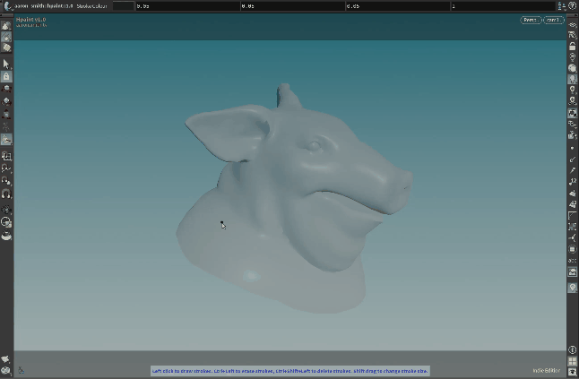

#  HPaint 2.0 

### 🎨 HPaint is a viewport drawing utility for Houdini 19.5, allowing you to digitally paint on any geometry.

The concept is similar to Blender's Grease Pencil utility, with extra features allowing you to also perform 2D Animation tasks, draw in your viewport with Screen Drawing, control your drawing methods and enable geometry masking, as well as 'layer' your strokes with surface distance offsets and primitive groups.

Each stroke is a 3D card with UVs - allowing you to texture your strokes similar to using a custom brush in Photoshop.

### 🆕 New to HPaint 2.0
- Updated for Houdini 19.5
- Major optimizations for cache evaluation, drawing and data handling.
- Added `Disable Geometry Mask` toggle to allow strokes drawn off-geometry. 
    - Strokes are evaluated from the last normal-plane distance of the geometry before it went off-geometry.
    - Strokes have an intelligent repositioning algorithm to allow strokes to look fluid no matter how they are drawn.
- Revamped `Screen Drawing` functionality.
    - You can now screen draw in any present viewport. Previously you could only draw in camera view.
    - You can choose between `Continuous` (Always screen draw at the `ScDraw Distance`) and `Once` (Draw from the first depth-picked position) modes.
    - You can hold `MMB` to pick the `ScDraw Distance` depth from your present viewport.
- Added `Output Curves Only` toggle, which disables stroke card construction.
- Added extra visualization options in their own tab.
    - Modern tool-tips have been added per 19.5 viewer state guidelines.

## 🗝️ Key Features
- **🖌️ Digital Painting on your Geometry**: Plug HPaint into any SOP and start drawing! By default, HPaint allows you to draw on geometry and mask your strokes to the geometry itself.
- **✍️ Screen Drawing**: HPaint offers versatile options for screen drawing, with the `Depth Picker` utility, depth sampling methods and an interactive screen distance parameter.
- **🎬 2D Animation**: Get started instantly with the `$F` frame tag in your filename and the `Display Nearest Frame` toggle to start animating like you would in softwares such as Toon Boom!
- **💽 Smart Disk Caching**: Save your HPaint cache out and share it with other HPaint users - enabling collaborative workflows.

## 📥 Installation
[Download the HDA file](otls/aaronsmithtv__hpaint__2.0.hda) and install it to your `houdini19.5/otls/` folder. For detailed instructions, please refer to the [Houdini documentation](https://www.sidefx.com/docs/houdini/assets/install.html).

## ⏩ Quick Start
After installing HPaint, open a SOP context node view and connect HPaint's single input to any geometry, preferably with the `N` normal attribute configured correctly. A test geometry works well for initial usage.

With the display for the HPaint SOP enabled, move your cursor to the viewport and press `Enter`. This will display the tool-tips for HPaint, letting you know that the initialization has worked as intended.

Begin creating strokes by holding `LMB` on your geometry - as you would in any other digital painting software! If you want to draw everywhere, toggle `Screen Drawing` or toggle `Disable Geometry Mask` to paint wherever you want on the viewport.

## 💡 Feedback
If you have any feedback or run into issues, please feel free to open an issue on this GitHub project. I really appreciate your support!

